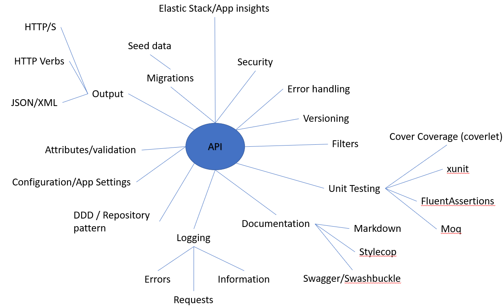

# AFI - Technical test

## Ideas

## Release history
|Version|Release date|Comments|
|-------|------------|--------|
|0.1    |15th October 2020|Initial release|

## Packages
### MVC Versioning
Used to version API controllers
https://www.nuget.org/packages/Microsoft.AspNetCore.Mvc.Versioning
### Swagger + Swashbuckle
Internal only! - API specification tool
https://www.nuget.org/packages/Swashbuckle.AspNetCore.Swagger/
To view the Swagger documentation generated. Start the API project and navigate to http://localhost:5000/swagger *if the default Port hasn't been changed*
### Serilog
Used for easier formatting of console read out but also allows many different sinks to be used easily
https://www.nuget.org/packages/Serilog/2.10.1-dev-01249
### Application Insights
Not fully implemented but shows how logging could be pushed to App Insights
https://www.nuget.org/packages/Microsoft.ApplicationInsights.AspNetCore/

## Documentation

### Structure
The codebase implements the DDD structure. for an aid please use the link below.
https://docs.microsoft.com/en-us/dotnet/architecture/microservices/microservice-ddd-cqrs-patterns/ddd-oriented-microservice

#### AFI.API
API project - consumes all lower level projects to become the endpoint (point of contact)

#### AFI.Domain
This project is concerned with aggregating data from the persistence layer to output from the API.

#### AFI.Persistence
This project is concerned with Database storage and retrieval. It is a Code First migration .NET Core application. The repository pattern can be used to aggregate Domain models in to single units of work.

#### AFI.Test
This is the .NET Core unit testing project for the entire solution. Folder structre mirrors projects. Please see section below.

## DB Migrations
Open a command prompt and navigate to the AFI.Persistance folder.

To create new migrations:
`dotnet ef --startup-project ../AFI.API/ migrations add Initial --context AFIContext`

To run migrations:
`dotnet ef --startup-project ../AFI.API/ database update --context AFIContext`
*The connection string assumes SQL Authentication with a username and password of "api".*

## Testing
Uses XUnit, Fluent Assertions and Coverlet( to collect code coverage)
To Test in CMD:
`dotnet test`
and to collect code coverage
`dotnet test --collect:"XPlat Code Coverage"`

## Considerations
The API endpoint (referring to single controller and endpoint for this test) will only return a 200 or 400 message. It is bad practice to identity validation failures when dealing with security/GDPR data. Any exceptions will not be returned.

Submitted data validation should take place within a seperate utility to allow re-use. Perhaps should the user wish to edit the stored data then the resultin form POST will need the same validation applied.

The Unit Testing is a flavour of what would be required. Within the timescale of the test I felt it prudent to merely show how it would be approached rather than all out 100% code coverage.

I would normally create a full Base Entity and Base Repository to inherit from. This is a example implementation.

I would fully implement SeriLog to output to a variety of sinks. Such as perhaps Application Insights, DataDog, local XML files(not recommended), Elastic Stack, SQL database.

I would consider the use of HSTS and HTTP/S redirection.

I would correct all stylecop issues and use a company wide ruleset.

I would consider logging database changes within audit tables.